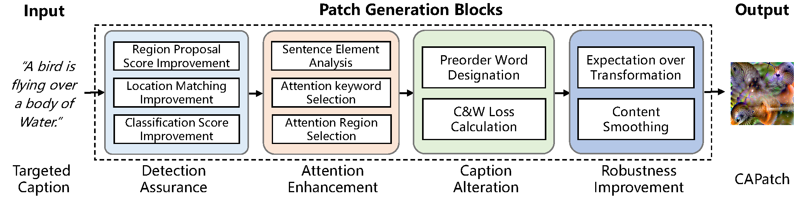

# What is *CPatch* attack?

The fast-growing surveillance systems will make image captioning,  *i.e.*, automatically generating text descriptions of images, an essential technique to process the huge volumes of videos efficiently, and correct captioning is essential to ensure the text authenticity. While prior work has demonstrated the feasibility of fooling computer vision models with adversarial patches, it is unclear whether the vulnerability can lead to incorrect captioning, which involves natural language processing after image feature extraction. 

In this paper, we design *CAPatch*, a physical adversarial patch that can result in mistakes in the final captions, *i.e.*, either create a completely different sentence or a sentence with keywords missing, against multi-modal image captioning systems. To make *CAPatch* effective and practical in the physical world, we propose a detection assurance and attention enhancement method to increase the impact of *CAPatch* and a robustness improvement method to address the patch distortions caused by image printing and capturing. Evaluations on three commonly-used image captioning systems (Show-and-Tell, Self-critical Sequence Training: Att2in, and Bottom-up Top-down) demonstrate the effectiveness of *CAPatch* in both the digital and physical worlds, whereby volunteers wear printed patches in various scenarios, clothes, lighting conditions. With a size of 5% of the image, physically-printed *CAPatch* can achieve continuous attacks with an attack success rate higher than 73.1% over a video recorder.

# How does *CPatch* work?

## Overview

- The  **Detection Assurance** module designs a detection loss considering both the
region proposal probabilities and the classification results, to make Faster R-CNN based encoders propose as many boxes as possible on any region that CAPatch appears.
- The  **Attention Enhancement** module first analyzes the elements of the targeted caption, then selects keywords that need extra attention, and finally enhances the weights of CAPatch related regions when generating those selected words.
- The **Caption Alteration** module exploits the vulnerabilities of both the computer vision model and the LSTM model, and designs a caption loss to make it output the targeted sentence.
- The **Robustness Improvement** module improves the robustness of CAPatch in the physical world by addressing the patch distortions caused by both non-ideal placements and photographing.

# Demo

Here are several [demo videos](https://sites.google.com/view/capatch) of real-world evaluation.

# Environment

- python 3.8.12
- torch 1.7.0
- torchvision 0.8.0

# Data

You should download [data](https://drive.google.com/drive/folders/1SnWSLaHcS5ViYRyLeRxFjm1ypOLJ_YIF?usp=sharing) and place them under the folder `data`.

# Dataset

Please place the images under the folder `dataset`.

# Paper

For more details, you can download the paper from this [link](./assets/CPatch.pdf).

# Contact

* Prof. Wenyuan Xu (<wyxu@zju.edu.cn>)
* Prof. Xiaoyu Ji (<xji@zju.edu.cn>)

# Powered by

## Ubiquitous System Security Laboratory (USSLab)

## Zhejiang University 

